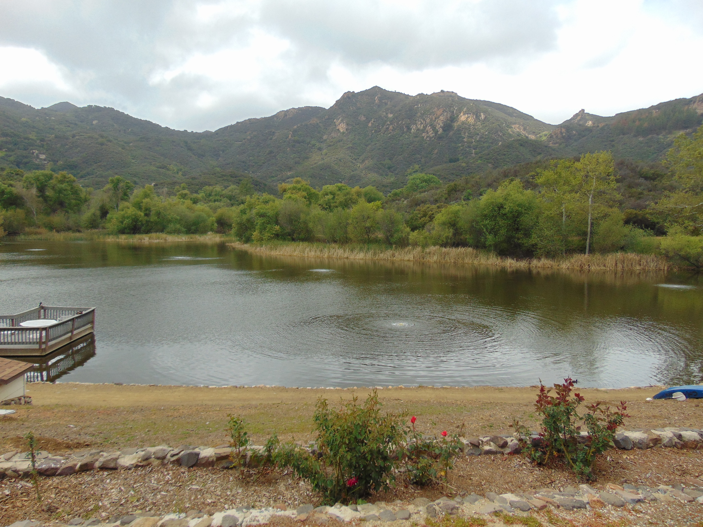

+++
title = "Chapter 1: Hugo, where art thou..."
date = 2025-03-12T09:32:11+08:00
categories = ["Development", "Design", "Hugo"]  
tags = ["Go", "Mac", "Hugo Theme", "Niello"] 
keywords = ["Hugo", "Theme", "Niello", "Blogging", "Website"] 
description = "My experience setting up the Niello Hugo theme for my first blog post—the triumphs and tribulations!"
draft = false
+++

## Part 1: The struggle

**The fog hangs heavy tonight...** a damp shroud clinging to Seminole Springs, mirroring the oppressive weight of my latest endeavor. I, Manolo Evans, purveyor of the finest catches and occasional investigator of the… unnatural, have been wrestling with a new kind of beast: Hugo.

They call it a "static site generator," these university-bred scholars, whispering of "Go" and "Markdown" as if they held the key to some forbidden knowledge. Static, they say. As if Seminole Springs itself isn't a chaotic maelstrom of whispers and creeping shadows from the mountain.  This Hugo, however, proves far more monstrous than any Deep One I've ever encountered.

## First came the submodules. 
This cursed Niello theme, a repository as tangled as the seaweed forests of the abyss, refused to cooperate. I tried to add it as a submodule—a process as inscrutable as deciphering a message written in the blood of a sacrificed seabird.  fatal: 'themes/Niello' already exists in the index, the machine hissed, its digital wrath as cold and implacable as the ocean depths.  I fought with it, battling the command line like a kraken, until I managed to banish the error, only to find myself lost in a maze of git add, git rm, and git commit commands, each step as perilous as venturing into the forbidden cove of the Deep Ones.

## Then came the images.  
Simple things, one might think—a few icons representing the humble tools of my trade: Email, GitHub, LinkedIn. Yet, they refused to appear on my pages.  I wrestled with the paths, /Users/manoloevans/projects/blog/public/image/email.png taunting me—a local path that meant nothing to the digital world. I tried absolute paths, relative paths; I tried every permutation, until finally I managed to place the blasted things where they should be, only to find they were grotesquely oversized, filling my page with an unseemly bulk.  Their unnatural size seemed to mock my efforts.

Navigation links were a similar torment.  A simple link to my contact page, yet the blasted thing refused to function.  It floated there, inert as a drowned sailor, his eyes fixed on some unknowable horror in the deep. Errors in the HTML of the template, hidden, needing repairs. The contact page was not linked nor set up in any form. After copying and modifying the existing pages, I prevailed.

Even the creation of this first post—a testament to my struggles—proved a challenge.  Writing about these technological hellscapes proved an ordeal in itself. It felt like trying to write on papyrus with ink made from the ichor of a dead god. But I persevere! I will conquer this Hugo, or it will consume me—a fate worse than being dragged to the depths by a colossal, many-tentacled beast. But at last now the images are working and contact pages functioning, if still somewhat oversized. I can finally, start journalling my programmers Journey.

***(To be continued...)***